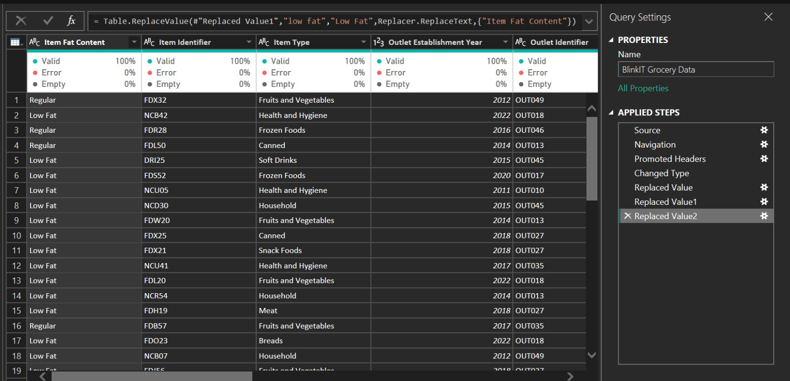

# 🛒 Blinkit Grocery Sales Performance Dashboard
An end-to-end data analysis project visualizing sales performance, outlet trends, and business KPIs using Power BI.

## 🛠️ Project Process

### Step 1: Data Cleaning & Transformation
The first step was to ensure data integrity using Power Query. This involved handling inconsistencies in the "Item Fat Content" column to ensure accurate categorization.

*   **Action:** Used `Table.ReplaceValue` to standardize text values like "low fat" to "Low Fat".
*   **Outcome:** Created a consistent dataset ready for accurate DAX modeling.
