# 🛒 Blinkit Grocery Sales Performance Dashboard
An end-to-end data analysis project visualizing sales performance, outlet trends, and business KPIs using Power BI.

## 🛠️ Project Process

### Step 1: Data Cleaning & Transformation
The first step was to ensure data integrity using Power Query. This involved handling inconsistencies in the "Item Fat Content" column to ensure accurate categorization.

* **Action**: Used `Table.ReplaceValue` to standardize text values like "low fat" to "Low Fat".
* **Outcome**: Created a consistent dataset ready for accurate DAX modeling.

### Step 2: Dashboard UI Design
The second step focused on setting up the aesthetic framework for the report.

* **Action**: Designed the dashboard layout and color scheme to ensure a professional and user-friendly interface.
* **Outcome**: Established a consistent visual foundation for the final dashboard display.

### Step 3: Branding & Asset Integration
The third step involved incorporating official branding to align the dashboard with the Blinkit visual identity.

* **Action**: Integrated the Blinkit logo and tagline into the dashboard sidebar.
* **Outcome**: Created a professional, branded look that enhances the report's credibility.

### Step 4: Data Modeling & Measure Creation
The fourth step involved defining key performance indicators (KPIs) through DAX to enable data-driven analysis.

* **Action**: Created calculated measures, including `Avg Rating`, `Avg Sales`, `No of Items`, and `Total Sales`.
* **Outcome**: Enabled dynamic calculations and comprehensive performance tracking across the dataset.

### Step 5: Core KPI Matrix Implementation
The fifth step focused on implementing the high-level summary cards to deliver immediate executive insights at a glance.

* **Action**: Constructed a consolidated card visual linking the primary DAX measures to show Total Sales, Average Sales, Number of Items, and Average Ratings.
* **Outcome**: Provided an instant, high-level snapshot of total business performance directly next to the navigation panel.

### Step 6: Visual Enhancement & Styling
The sixth step involved refining the visual presentation of the KPI cards to improve readability and user engagement.

* **Action**: Applied custom styling to the KPI cards, including active highlighting for the "Total Sales" metric.
* **Outcome**: Enhanced the visual hierarchy of the dashboard, drawing focus to critical business metrics.

### Step 7: Finalizing KPI Metric Data
The final step in this section involved refining the displayed values and adding representative icons to provide a more intuitive and visually informative interface.

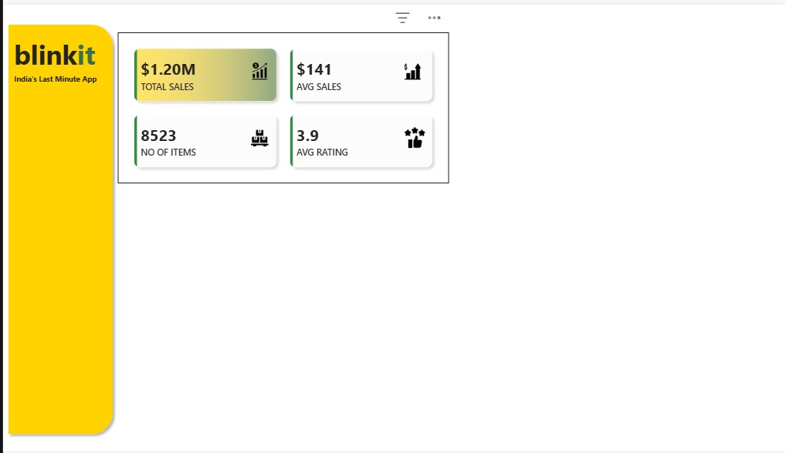

* **Action**: Updated card values with precise figures and incorporated descriptive icons for "Total Sales," "Avg Sales," "No of Items," and "Avg Rating".
* **Outcome**: Improved the interpretability of the high-level metrics, allowing users to quickly correlate data points with their respective categories.

### Step 8: Main Dashboard Container Setup
The eighth step involved establishing the structural foundation for the main analytical views of the dashboard.

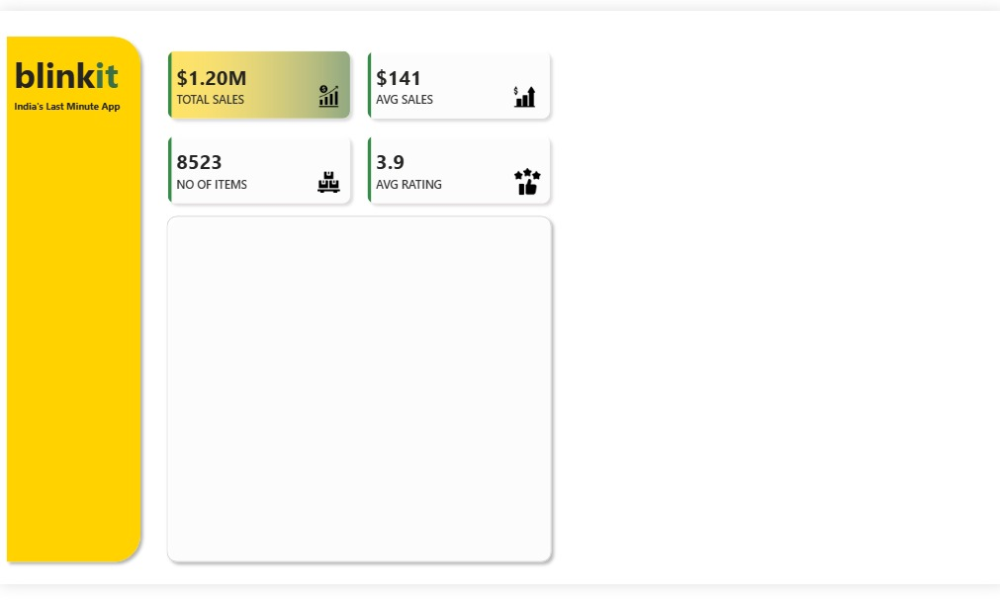

* **Action**: Implemented a primary container element beneath the KPI metrics to act as a placeholder for upcoming detailed charts and graphs.
* **Outcome**: Defined the layout structure for the analytical section, ensuring a clean and balanced dashboard composition.

### Step 9: Item Fat Content Analysis
The ninth step involved adding a Donut Chart to visualize how "Item Fat Content" contributes to overall sales.

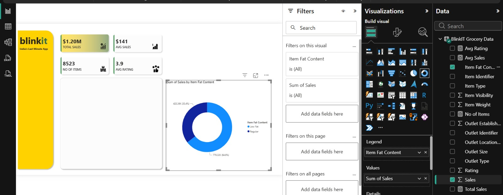

* **Action**: Mapped "Item Fat Content" to the Legend field and "Sales" to the Values field to create a comparative analysis chart.
* **Outcome**: Provided an immediate visual breakdown of sales distribution between "Low Fat" and "Regular" items.

### Step 10: Dynamic Parameter Configuration
The tenth step focused on enhancing interactivity by adding a Field Parameter to allow users to dynamically switch between different metrics.

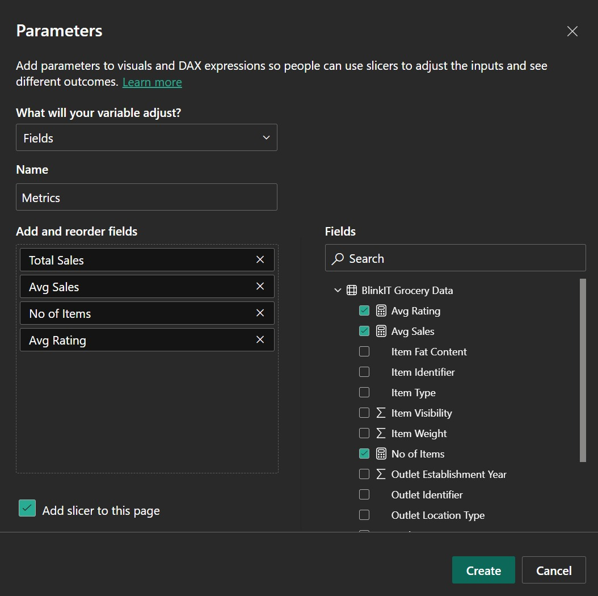

* **Action**: Configured a new parameter named "Metrics" that includes "Total Sales," "Avg Sales," "No of Items," and "Avg Rating," with "Add slicer to this page" enabled.
* **Outcome**: Empowered users to toggle between different performance metrics directly from the dashboard for a more personalized analysis experience.

### Step 11: Parameter-Driven Visualization
The eleventh step involved integrating the newly created field parameters to make visual representations reactive to user selection.

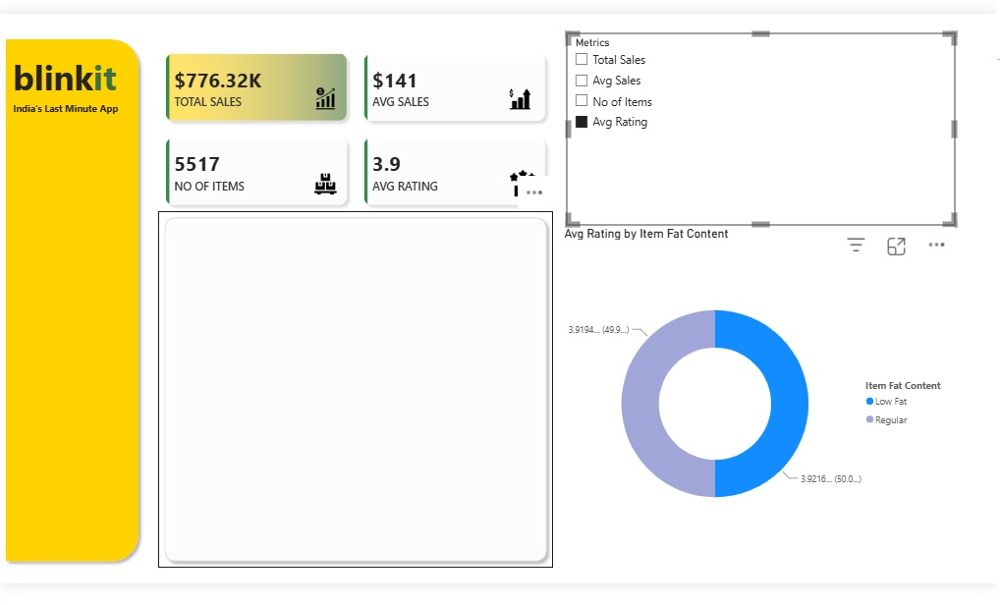

* **Action**: Added the "Metrics" slicer to the dashboard and updated the Donut Chart to utilize the selected metric for visualization.
* **Outcome**: Enabled a dynamic reporting environment where the chart updates in real-time based on the metric selected by the user (e.g., viewing "Avg Rating" by "Item Fat Content").

### Step 12: Finalizing UI and Slicer Styling
The twelfth step focused on polishing the dashboard's UI by styling the "Metrics" slicer buttons for better clarity and alignment with the overall design.

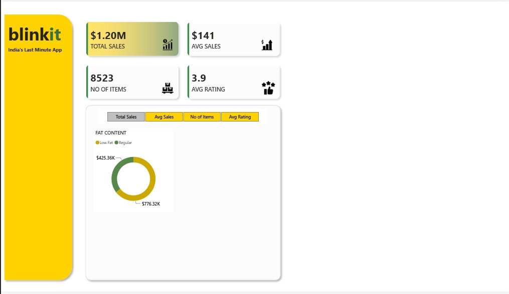

* **Action**: Customized the slicer appearance to feature clear, distinct buttons for "Total Sales," "Avg Sales," "No of Items," and "Avg Rating".
* **Outcome**: Created a highly polished, intuitive navigation experience that makes switching between different performance views seamless and visually cohesive.

### Step 13: Fat Content Analysis by Outlet Tier
The thirteenth step added a Bar Chart to analyze sales distribution based on both "Item Fat Content" and "Outlet Location Type".

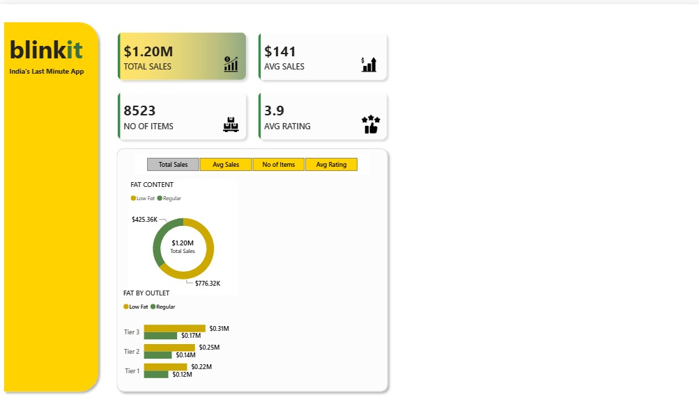

* **Action**: Implemented a stacked bar chart showing sales categorized by Fat Content across different Outlet Tiers.
* **Outcome**: Provided deeper geographical and product-category insights, revealing how fat content preferences vary across different tiers of outlet locations.

### Step 14: Sales Performance by Item Type
The fourteenth step involved adding a horizontal bar chart to analyze sales performance across different item categories.

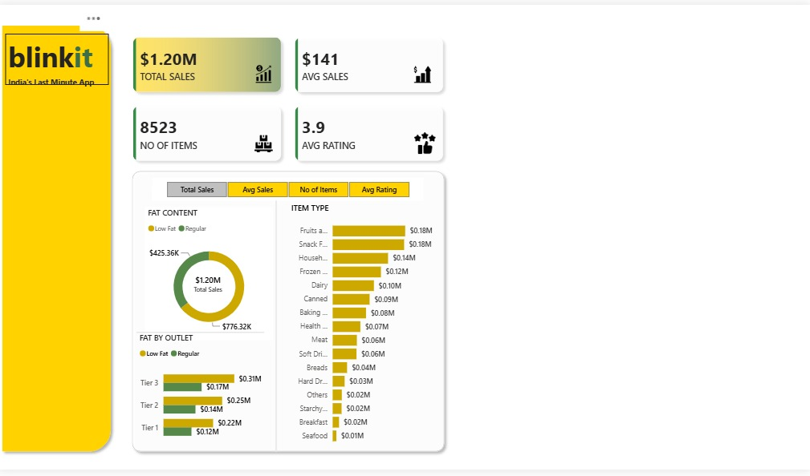

* **Action**: Mapped "Item Type" to the Y-axis and "Sales" to the X-axis to visualize the sales contribution of each product category.
* **Outcome**: Enabled clear identification of top-performing product categories (e.g., "Fruits and Vegetables" and "Snack Foods"), allowing for better inventory and marketing prioritization.

### Step 15: Expansion of Analysis Area
The fifteenth step focused on optimizing the dashboard layout by incorporating a secondary container area to host further analytical visuals.

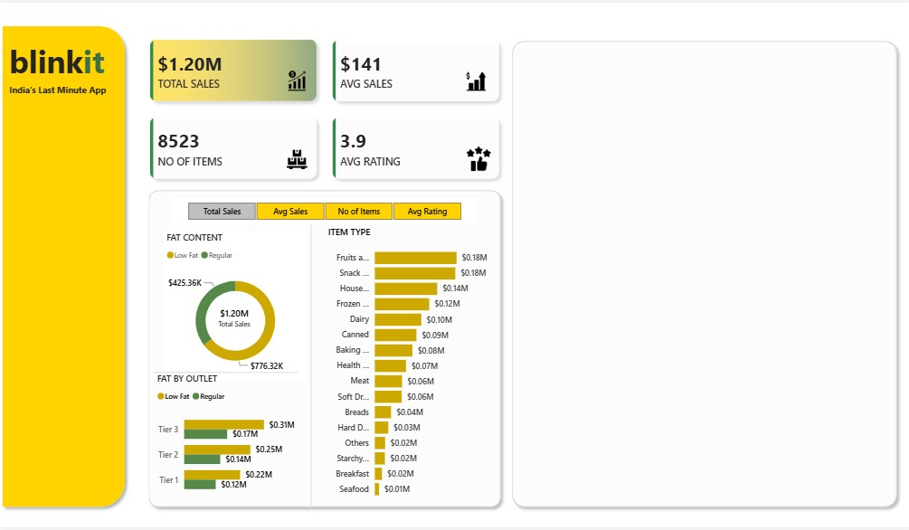

* **Action**: Integrated a new, larger container panel on the right side of the dashboard.
* **Outcome**: Increased the overall workspace, facilitating the addition of more complex analytical charts and data representations without cluttering the existing interface.

### Step 16: Trend Analysis by Outlet Establishment Year
The sixteenth step involved adding a line chart to visualize how sales trends have evolved over the years based on the outlet establishment date.

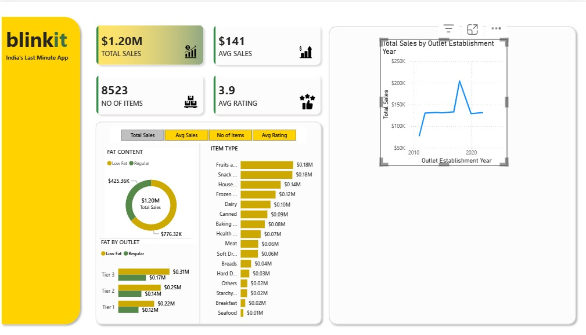

* **Action**: Mapped "Outlet Establishment Year" to the X-axis and "Total Sales" to the Y-axis to create a line trend chart.
* **Outcome**: Allowed for the analysis of performance trends over time, helping to identify potential correlations between the age of an outlet and its sales performance.

### Step 17: Outlet Size Analysis
The seventeenth step added a secondary Donut Chart to analyze sales distribution based on "Outlet Size".

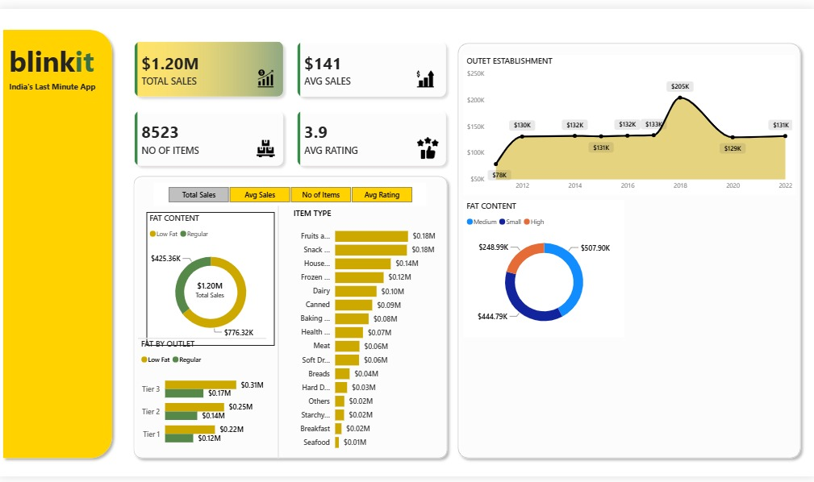

* **Action**: Mapped "Outlet Size" to the Legend field and "Sales" to the Values field to categorize total performance by size.
* **Outcome**: Provided a clear visualization of how different outlet sizes (Medium, Small, High) contribute to the overall sales volume.

### Step 18: Outlet Location Analysis
The eighteenth step involved adding a funnel chart to analyze sales performance across different outlet location tiers.

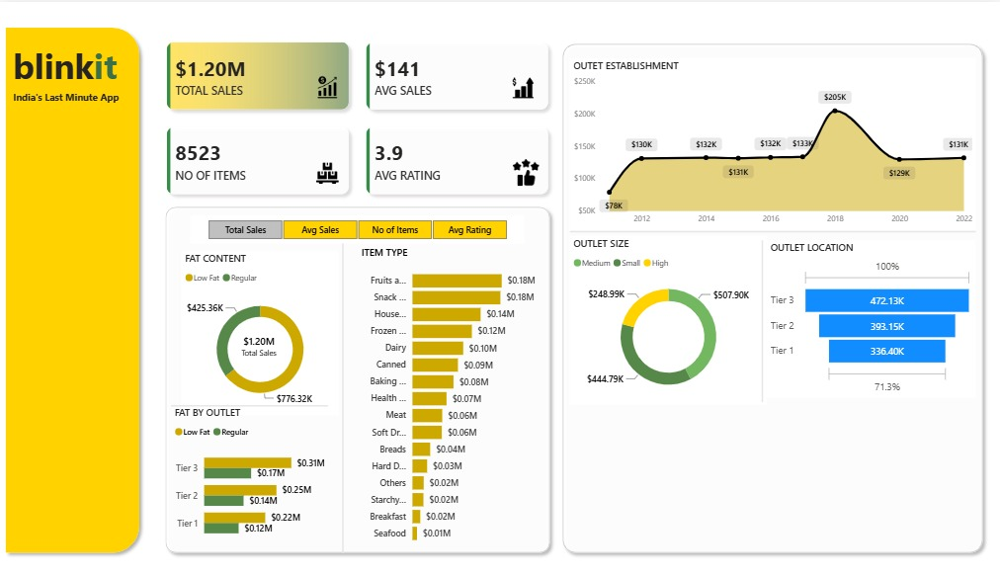

* **Action**: Mapped "Outlet Location Type" to the Category field and "Sales" to the Values field to create a funnel chart.
* **Outcome**: Enabled a clear comparative analysis of sales across Tier 1, Tier 2, and Tier 3 locations, highlighting performance distribution.

### Step 19: Outlet Type Performance Table
The nineteenth step involved adding a table to provide a granular view of performance metrics categorized by outlet type.

* **Action**: Created a table visual containing "Outlet Type," "Total Sales," and "No of Items" to offer detailed performance data.
* **Outcome**: Provided a comprehensive summary table that complements the graphical visualizations, allowing for direct comparison of total sales and item counts across different store types.
