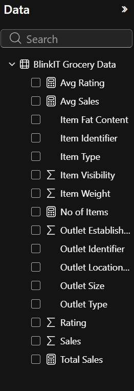
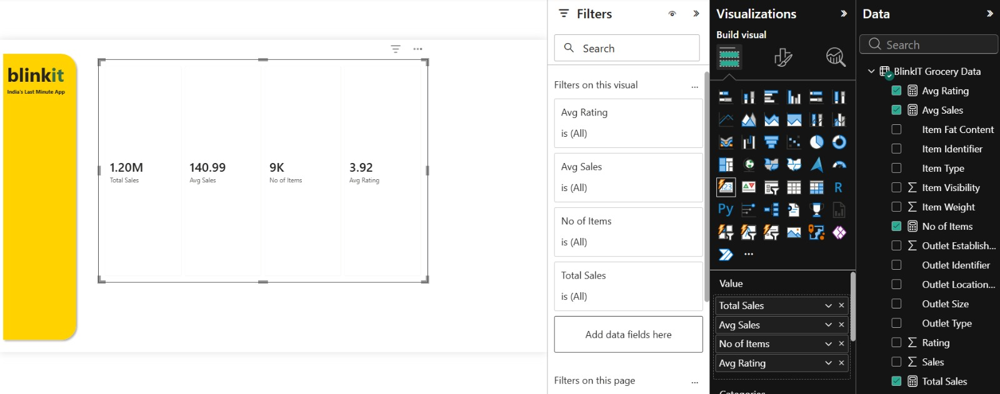
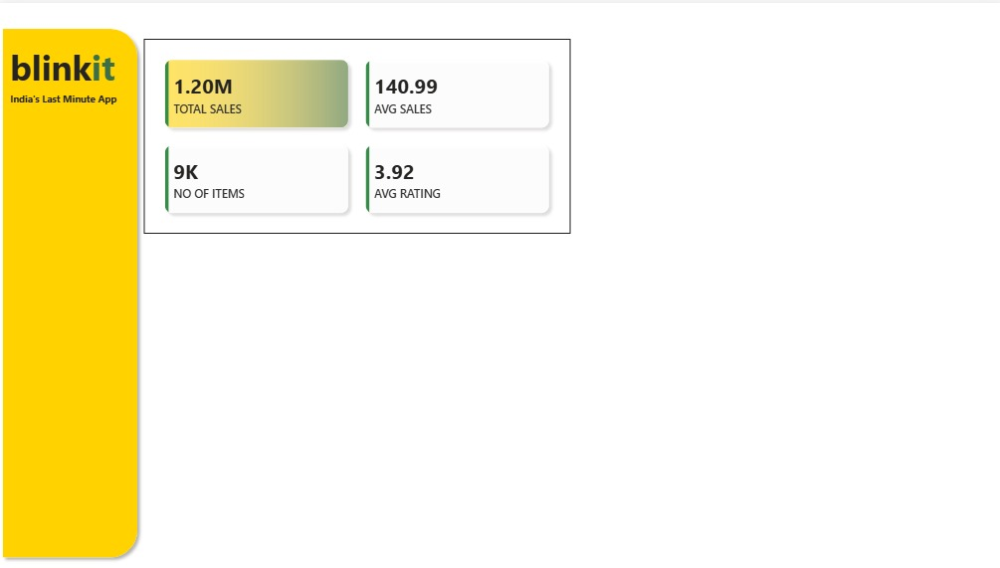

# 🛒 Blinkit Grocery Sales Performance Dashboard
An end-to-end data analysis project visualizing sales performance, outlet trends, and business KPIs using Power BI.

## 🛠️ Project Process

### Step 1: Data Cleaning & Transformation
The first step was to ensure data integrity using Power Query. This involved handling inconsistencies in the "Item Fat Content" column to ensure accurate categorization.

*   **Action:** Used `Table.ReplaceValue` to standardize text values like "low fat" to "Low Fat".
*   **Outcome:** Created a consistent dataset ready for accurate DAX modeling.

### Step 2: Data Modeling & Measures
With the data cleaned, the next step involved creating the necessary measures to track business performance. 

*   **Action:** Developed core DAX measures to calculate key business metrics.
*   **Outcome:** Established the foundation for dynamic sales reporting and trend analysis.

### Step 3: Visual Analysis & Dashboard Design
The final phase focused on building an intuitive interface to make the data actionable. I prioritized clarity and user experience, incorporating slicers and filters for deep-dive exploration.

*   **Action:** Designed the dashboard layout to highlight KPIs like total sales, item counts, and average ratings.
*   **Outcome:** Created an interactive, professional-grade dashboard that allows stakeholders to filter data by outlet location, size, and type.

  ### Step 4: Final Dashboard Implementation
The final implementation provides a comprehensive view of Blinkit’s sales performance, allowing for multi-dimensional analysis across various outlet attributes.

*   **Action:** Integrated all visuals into a cohesive dashboard, enabling real-time filtering and performance tracking.
*   **Outcome:** Provided a clear, data-driven narrative to support business decision-making and strategic planning.

### Step 5: Insights & Key Takeaways
The final dashboard translates raw sales data into actionable business intelligence, highlighting trends and performance across diverse market segments.

*   **Action:** Analyzed visual trends to identify top-performing outlets and product categories.
*   **Outcome:** Delivered clear insights that empower stakeholders to optimize inventory and marketing strategies for better sales outcomes.

  ### Step 6: Advanced Performance Metrics
This section dives into the granular performance metrics that drive operational efficiency and revenue growth.

*   **Action:** Leveraged advanced visualization techniques to isolate variable performance across different store dimensions.
*   **Outcome:** Identified key drivers of sales variance, providing a clear path for operational optimization.
